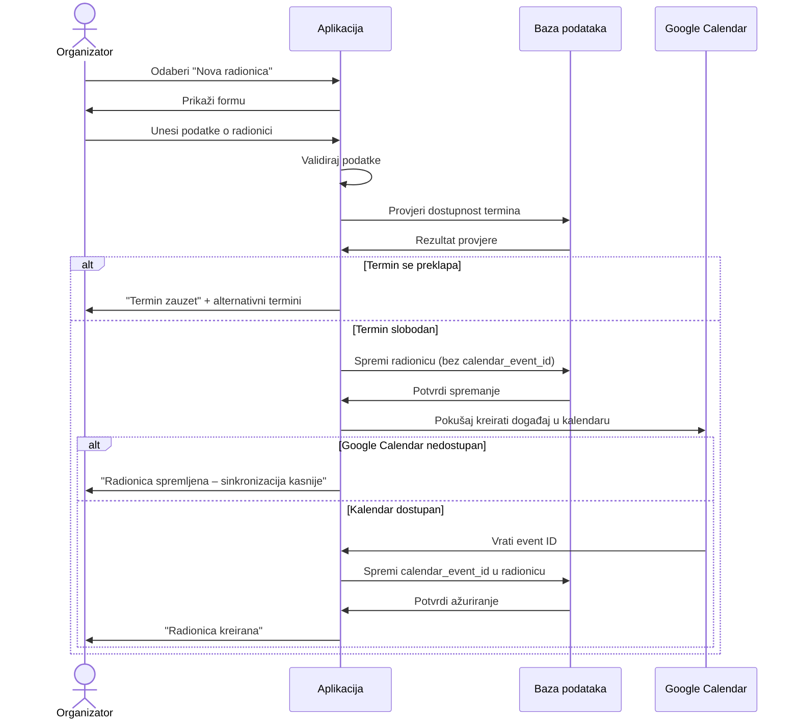

```mermaid
sequenceDiagram
    actor Organizator
    participant A as Aplikacija
    participant DB as Baza podataka
    participant GC as Google Calendar

    Organizator->>A: Odaberi "Nova radionica"
    A->>Organizator: Prikaži formu
    Organizator->>A: Unesi podatke o radionici

    A->>A: Validiraj podatke
    A->>DB: Provjeri dostupnost termina
    DB->>A: Rezultat provjere

    alt Termin se preklapa
        A->>Organizator: "Termin zauzet" + alternativni termini

    else Termin slobodan
        A->>DB: Spremi radionicu (bez calendar_event_id)
        DB->>A: Potvrdi spremanje

        A->>GC: Pokušaj kreirati događaj u kalendaru

        alt Google Calendar nedostupan
            A->>Organizator: "Radionica spremljena – sinkronizacija kasnije"

        else Kalendar dostupan
            GC->>A: Vrati event ID
            A->>DB: Spremi calendar_event_id u radionicu
            DB->>A: Potvrdi ažuriranje
            A->>Organizator: "Radionica kreirana"
        end
    end

```
