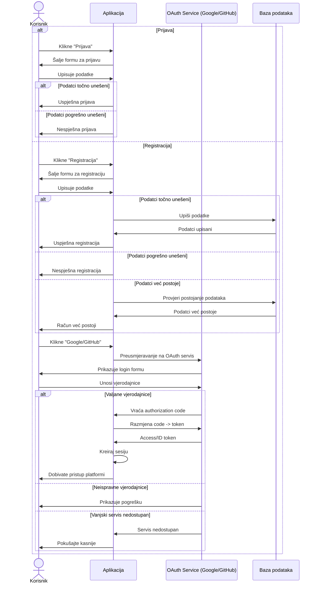

```mermaid
sequenceDiagram
    actor Korisnik
    participant A as Aplikacija
    participant O as OAuth Service (Google/GitHub)
    participant DB as Baza podataka

    alt Prijava
        Korisnik->>A: Klikne "Prijava"
        A ->> Korisnik: Šalje formu za prijavu
        Korisnik ->> A: Upisuje podatke

        alt Podatci točno unešeni
            A ->> Korisnik: Uspješna prijava

        else Podatci pogrešno unešeni
            A ->> Korisnik: Nespješna prijava
        end

    else Registracija
        Korisnik->>A: Klikne "Registracija"
        A ->> Korisnik: Šalje formu za registraciju
        Korisnik ->> A: Upisuje podatke

        alt Podatci točno unešeni
            A ->> DB: Upiši podatke
            DB ->> A: Podatci upisani
            A ->> Korisnik: Uspješna registracija

        else Podatci pogrešno unešeni
            A ->> Korisnik: Nespješna registracija
        else Podatci već postoje
        A ->> DB: Provjeri postojanje podataka
        DB ->> A: Podatci već postoje
        A ->> Korisnik: Račun već postoji

        end

    Korisnik->>A: Klikne "Google/GitHub"
    A ->> O: Preusmjeravanje na OAuth servis
    O ->> Korisnik: Prikazuje login formu
    Korisnik ->> O: Unosi vjerodajnice

        alt Valjane vjerodajnice
            O ->> A: Vraća authorization code
            A ->> O: Razmjena code -> token
            O ->> A: Access/ID token
            A ->> A: Kreiraj sesiju
            A ->> Korisnik: Dobivate pristup platformi

        else Neispravne vjerodajnice
            O ->> Korisnik: Prikazuje pogrešku

        else Vanjski servis nedostupan
            O ->> A: Servis nedostupan
            A ->> Korisnik: Pokušajte kasnije
        end
    end
```
