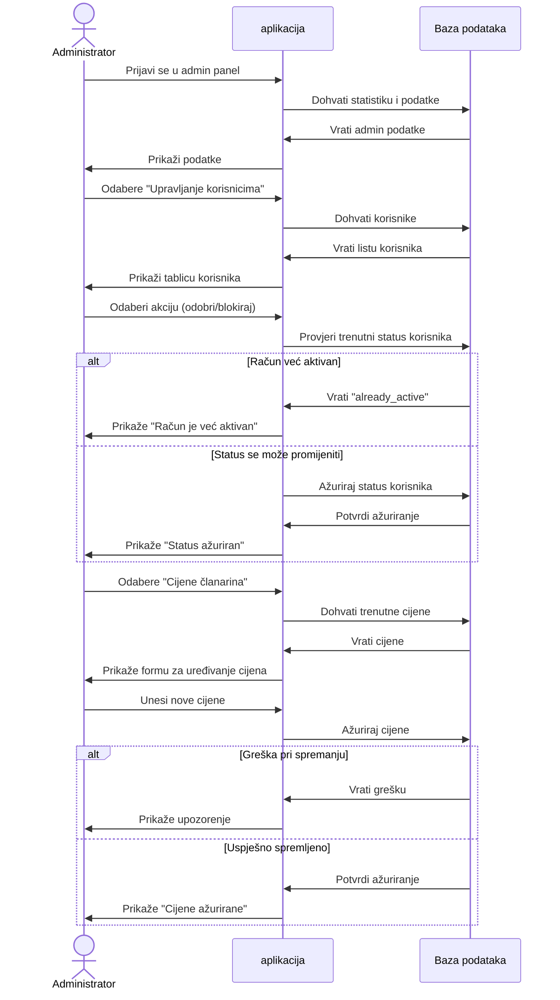

```mermaid
sequenceDiagram
    actor Administrator
    participant A as aplikacija
    participant DB as Baza podataka

    Administrator->>A: Prijavi se u admin panel
    A->>DB: Dohvati statistiku i podatke
    DB->>A: Vrati admin podatke
    A->>Administrator: Prikaži podatke
    
    Administrator->>A: Odabere "Upravljanje korisnicima"
    A->>DB: Dohvati korisnike
    DB->>A: Vrati listu korisnika
    A->>Administrator: Prikaži tablicu korisnika
    
    Administrator->>A: Odaberi akciju (odobri/blokiraj)
    A->>DB: Provjeri trenutni status korisnika
    
    alt Račun već aktivan
        DB->>A: Vrati "already_active"
        A->>Administrator: Prikaže "Račun je već aktivan"
    else Status se može promijeniti
        A->>DB: Ažuriraj status korisnika
        DB->>A: Potvrdi ažuriranje
        A->>Administrator: Prikaže "Status ažuriran"
    end
    
    Administrator->>A: Odabere "Cijene članarina"
    A->>DB: Dohvati trenutne cijene
    DB->>A: Vrati cijene
    A->>Administrator: Prikaže formu za uređivanje cijena
    
    Administrator->>A: Unesi nove cijene
    A->>DB: Ažuriraj cijene
    
    alt Greška pri spremanju
        DB->>A: Vrati grešku
        A->>Administrator: Prikaže upozorenje
    else Uspješno spremljeno
        DB->>A: Potvrdi ažuriranje
        A->>Administrator: Prikaže "Cijene ažurirane"
    end
```
