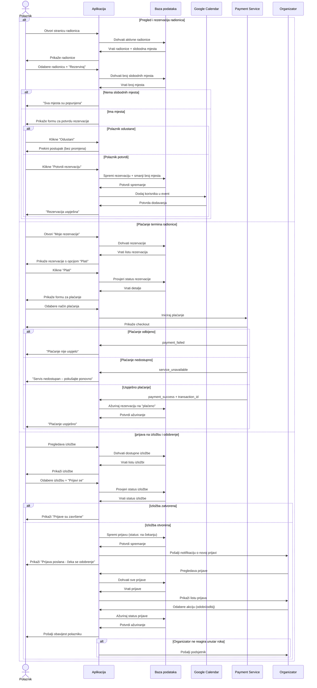

```mermaid
sequenceDiagram
    actor Polaznik
    participant A as Aplikacija
    participant DB as Baza podataka
    participant GC as Google Calendar
    participant PS as Payment Service
    participant Organizator

    alt Pregled i rezervacija radionica
        Polaznik->>A: Otvori stranicu radionica
        A->>DB: Dohvati aktivne radionice
        DB->>A: Vrati radionice + slobodna mjesta
        A->>Polaznik: Prikaže radionice

        Polaznik->>A: Odabere radionicu + "Rezerviraj"
        A->>DB: Dohvati broj slobodnih mjesta
        DB->>A: Vrati broj mjesta

        alt Nema slobodnih mjesta
            A->>Polaznik: "Sva mjesta su popunjena"
        else Ima mjesta
            A->>Polaznik: Prikaže formu za potvrdu rezervacije

            alt Polaznik odustane
                Polaznik->>A: Klikne "Odustani"
                A->>Polaznik: Prekini postupak (bez promjena)
            else Polaznik potvrdi
                Polaznik->>A: Klikne "Potvrdi rezervaciju"
                A->>DB: Spremi rezervaciju + smanji broj mjesta
                DB->>A: Potvrdi spremanje

                A->>GC: Dodaj korisnika u event
                GC->>A: Potvrda dodavanja

                A->>Polaznik: "Rezervacija uspješna"
            end
        end

    else Plaćanje termina radionice
        Polaznik->>A: Otvori "Moje rezervacije"
        A->>DB: Dohvati rezervacije
        DB->>A: Vrati listu rezervacija
        A->>Polaznik: Prikaže rezervacije s opcijom "Plati"

        Polaznik->>A: Klikne "Plati"
        A->>DB: Provjeri status rezervacije
        DB->>A: Vrati detalje
        A->>Polaznik: Prikaže formu za plaćanje

        Polaznik->>A: Odabere način plaćanja
        A->>PS: Iniciraj plaćanje
        PS->>Polaznik: Prikaže checkout

        alt Plaćanje odbijeno
            PS->>A: payment_failed
            A->>Polaznik: "Plaćanje nije uspjelo"
        
        else Plaćanje nedostupno
            PS->>A: service_unavailable
            A->>Polaznik: "Servis nedostupan – pokušajte ponovno"
        
        else Uspješno plaćanje
            PS->>A: payment_success + transaction_id
            A->>DB: Ažuriraj rezervaciju na "plaćeno"
            DB->>A: Potvrdi ažuriranje
            A->>Polaznik: "Plaćanje uspješno"
        end
    
    else prijava na izložbu i odobrenje

        Polaznik->>A: Pregledava izložbe
        A->>DB: Dohvati dostupne izložbe
        DB->>A: Vrati listu izložbi
        A->>Polaznik: Prikaži izložbe
        
        Polaznik->>A: Odabere izložbu + "Prijavi se"
        A->>DB: Provjeri status izložbe
        DB->>A: Vrati status izložbe
        
        alt Izložba zatvorena
            A->>Polaznik: Prikaži "Prijave su završene"
        else Izložba otvorena
            A->>DB: Spremi prijavu (status: na čekanju)
            DB->>A: Potvrdi spremanje
            A->>Organizator: Pošalji notifikaciju o novoj prijavi
            A->>Polaznik: Prikaži "Prijava poslana - čeka se odobrenje"
            
            Organizator->>A: Pregledava prijave
            A->>DB: Dohvati sve prijave
            DB->>A: Vrati prijave
            A->>Organizator: Prikaži listu prijava
            
            Organizator->>A: Odabere akciju (odobri/odbij)
            A->>DB: Ažuriraj status prijave
            DB->>A: Potvrdi ažuriranje
            A->>Polaznik: Pošalji obavijest polazniku
            
            alt Organizator ne reagira unutar roka
                A->>Organizator: Pošalji podsjetnik
            end
        end
    end
```
